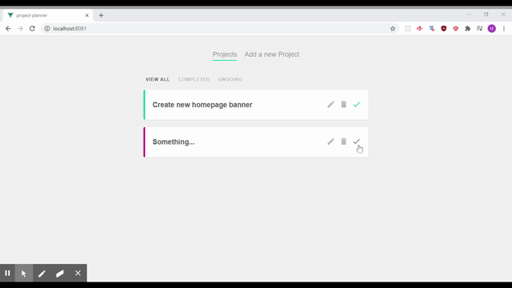

# Project Planner



This is a basic project planner built out in Vue.js, Vue Router, Node.js, and json-server to fetch API requests to POST/PATCH/DELETE various projects. You can mark these projects as complete, you can create them, you can edit them, or you can delete them. A simple app to demonstrate some capabilities with Vue. :)

## Project setup
```
npm install
```

### Compiles and hot-reloads for development
```
npm run serve
```

### Compiles and minifies for production
```
npm run build
```

### Customize configuration
See [Configuration Reference](https://cli.vuejs.org/config/).
